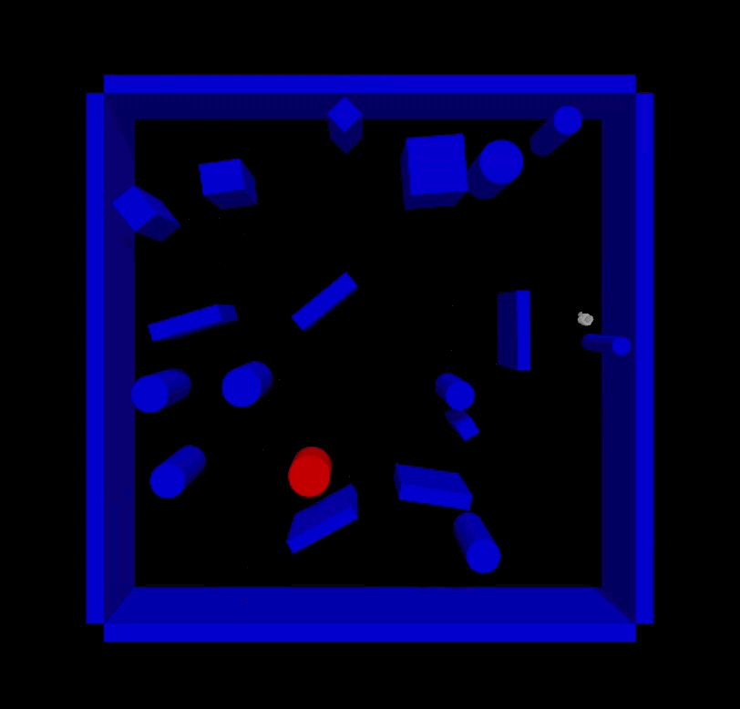

# Reinforcement Learning Approach to Robot Navigation and Obstacle Avoidance

> An infrastructure to train RL agents for a motion planning problem in a static environment (built with ROS2, Gazebo, OpenAI Gymnasium, and Stable Baselines 3).

## Description
This repository contains an application using ROS2 Kilted, Gazebo, OpenAI Gymnasium and Stable Baselines 3 to train reinforcement learning agents which generate a feasible sequence of motion controls for a differential drive robot equiped with a lidar to solve a motion planning problem.



The robot employed is a TurtleBot 3 with 2-wheel differential drive and a 360° lidar for obstacle detection. The lidar collects 36 distance measurements that can range from 0.32 to 8 meters.

This repository includes the following packages:
* turtle_astar: Navigation for the TurtleBot 3 without a map of its surroundings using online A* algorithm. This packages served as a baseline when reinforcement learning approach is evaluated.
* turtle_rl: RL model training infrastructure. It contains a Gymnasium custom environment tailored for the need of this project.
* turtle_interfaces: Custom ROS interfaces to support the turtle_rl package.

## Current status
This repository was created for my winter project at Northwestern University M.S. in Robotics program. Upon this post, the infrastructure is working properly in terms of training a decent model that solve a motion planning problem. Following optimization and document update is coming shortly.

## Table of contents
- [Installation](#installation)
- [Getting started](#getting-started)
    - [Train a model](#train-a-model)

## Installation
### Prerequisites
* ROS2 Kilted (with Ubuntu 24.04) - [install ROS2 Kilted](https://docs.ros.org/en/kilted/Installation.html);
* An already configured ROS2 workspace - [ROS2 workspace creation tutorial](https://www.youtube.com/watch?v=3GbrKQ7G2P0);
* Gazebo integration for ROS2 - [install gazebo with ROS](https://gazebosim.org/docs/ionic/ros_installation/);
* Stable Baselines 3 (includes also Gymnasium) - [install Stable Baselines 3](https://stable-baselines3.readthedocs.io/en/master/guide/install.html);
* Tensorboard - [install Tensorboard](https://pypi.org/project/tensorboard/);
### Step-by-step installation guide
First of all, clone this repository inside the src folder of your ROS2 workspace (replace `ros2_ws` with the name of your ROS2 workspace):
```
cd ~/ros2_ws/src
git clone https://github.com/ME495-Navigation/slam-zixinyenu.git
```

Now, stay in the `src` directory and copy the `auto.sh` bash script to the workspace directory:
```
cp auto.sh ../auto.sh
```

At this point, build your ROS2 workspace to effectively install the package (replace `ros2_ws` with the name of your ROS2 workspace).
```
cd ~/ros2_ws
colcon build --packages-select turtle_astar turtle_rl turtle_interfaces
```

## Getting started
### Train a model
Open two terminals. In the first terminal, enter the following commands to configure everything related to Gazebo (replace `ros2_ws` with the name of your ROS2 workspace):
```
cd ~/ros2_ws
source install/setup.bash
ros2 launch turtle_rl start_gazebo.launch.xml
```

In the second terminal, enter the following commands to configure everything related to RL training (replace `ros2_ws` with the name of your ROS2 workspace):
```
cd ~/ros2_ws
./auto.sh
```
